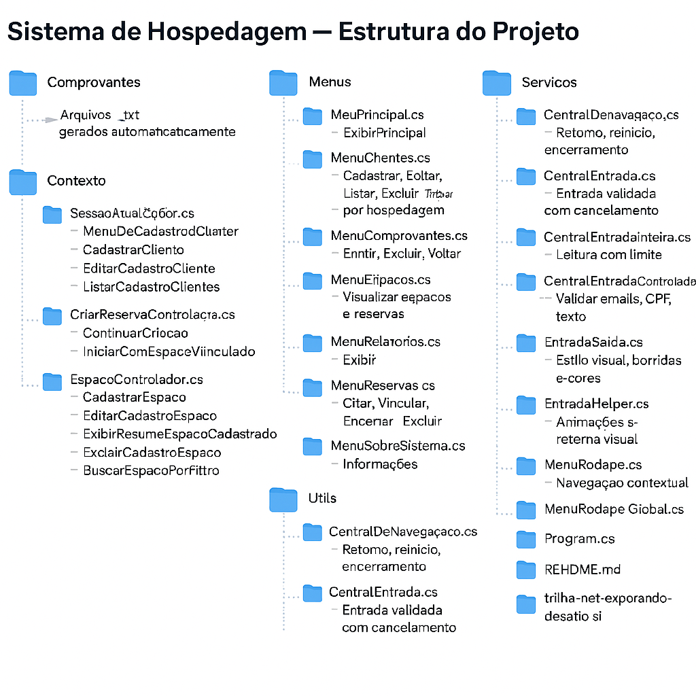

## Sistema de Gerenciamento de Hospedagem

Um sistema de terminal em C# para gerenciar espaços, hóspedes, reservas e emissão de comprovantes.  
Projetado com foco em **resiliência de entrada**, **experiência do usuário no console**, **modularidade** e **visual padronizado com cores**.

Ideal para hotéis, pousadas e centros de hospedagem.

## Bootcamp <a href="https://www.dio.me/" target= "_blank" > e  - End to End Engineering

----------------------------------------------------

QA - Utilizando Atlassian / Jira e Confluence

1- Casos de teste BDD

2- Casos de teste step-by-step

3- MindMap

4- Plano de fluxo de bug

5- Relatórios Atlassian

6- User stories

----------------------------------------------------

Características do sistema

## Entrada Segura (`EntradaHelper.cs`)

- Ação de direcionamento do usuário após pressionar 3x Enter
- Validações inteligentes de texto, números e e-mails
- Confirmação Sim/Não padronizada
- Nome sugerido com override
- Nenhum `ReadLine()` fora do helper

---

## Comprovantes

- Nome do(s) hóspede(s), espaço, valor, período
- Visual com bordas, alinhamento e cores
- Salvo automaticamente com confirmação
- Emissão condicionada à existência de reserva ativa

- Opções de:
  - Visualizar na tela com borda e cores
  - Salvar como `.txt` com codificação UTF-8 sem BOM
- Mensagem explicativa para testadores sobre o funcionamento do recurso
- Navegação final via rodapé com destino manual

---

## Menu Rodapé Dinâmico

✅ Entrada independente e fixa para rodapé

✅ Sem null, sem escape silencioso

✅ Mensagens emocionais suaves e escalonadas

✅ Centralização visual e coerência com o projeto inteiro

✅ Respeita a navegação reversa (Voltar) e principal (MenuPrincipal)

✅ Sai apenas com 0, nunca por ENTER solto

---

### Cadastro
- Espaços
- Clientes
- Reservas

### Listagem
- Espaços com status de ocupação
- Reservas por status
- Clientes cadastrados, clientes hospedados (hóspedes), clientes não hospedados

### Cancelamento e Exclusões
- Exclusões protegidas por confirmação
- Espaços não excluídos se estiverem ocupados

### Validação de Erros
- Entradas inválidas tratadas com mensagens claras
- Comportamento resiliente e sem travamentos

---

## Cores no Console

- 🔵 Azul: perguntas
- 🟥 Vermelho: erros
- ✅ Verde: sucesso
- ⚪ Branco: textos neutros

---

## Sobre o sistema
Sistema desenvolvido com foco no terminal intuitivo e acessível.  
A navegação por atalhos e mensagens coloridas facilita o uso mesmo para iniciantes.  
Todas as operações possuem validação, confirmação ou retorno visual.
---

## Conclusão

Sistema em fase de testes e correções, quase pronto para produção:

- ✅ Modular e organizado
- ✅ Interface amigável
- ✅ Fluxos seguros
- ✅ Estilização uniforme
- ✅ Operações com atalhos inteligentes

---

> Desenvolvido por  com atenção aos detalhes
  💛 Pensando na experiência do usuário.

## ▶️ Como executar

1. Clone o repositório:  
   `git clone https://github.com/QSoll/SistemaHospedagem.git`

2. Abra o projeto no Visual Studio ou VS Code

3. Compile e execute:  
   `dotnet run`

4. Navegue pelo menu principal e explore os módulos

